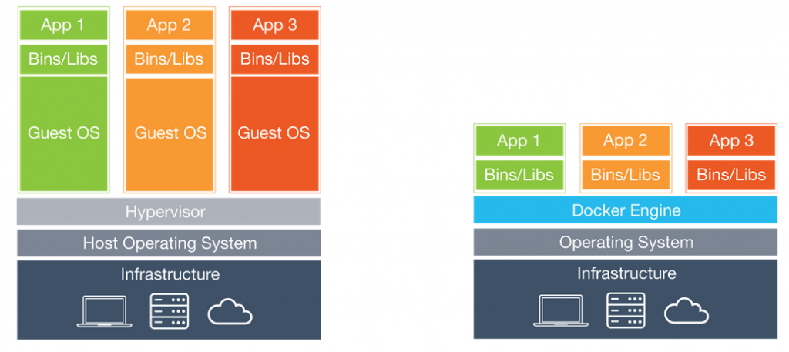
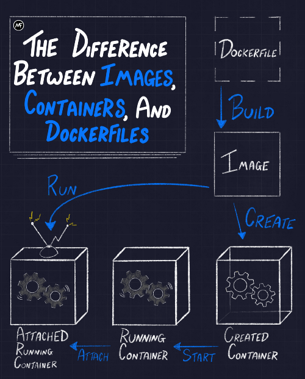
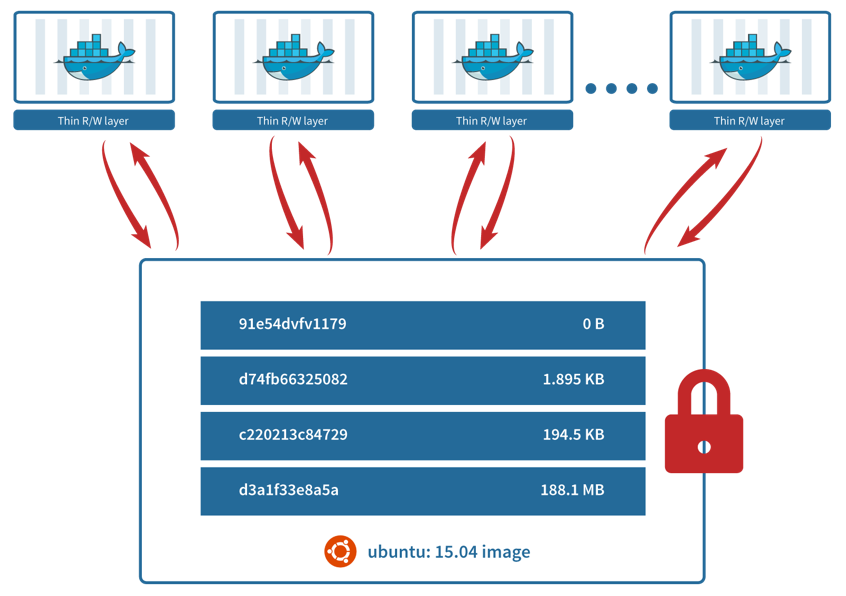

# Docker cheatsheet

**Contenedores Linux** es una tecnología que nos permite levantar cargas de trabajo aisladas dentro del mismo host. 

Cumplen un objetivo parecido a las máquinas virtuales. Se trata de compartir el mismo hardware para distintas aplicaciones. La diferencia es que los contenedores no necesitan instalar un sistema operativo nuevo. Esto significa un gran ahorro de memoria, disco, transmisiones de red y sobbre todo tiempo. Se aprovechan mejor los recursos hardware.

Con los contenedores puedes levantar varios servicios aislados unos de otros y del propio host, de forma igual de rápida y eficiente que si los levantasemos fuera de contenedores.

**Docker** es la tecnología que nos permite interactuar y crear contenedores de forma sencilla.

Diferencias entre imágenes, contenedores y Dockerfiles:

Los contenedores se levantan a partir de **imágenes**, que son plantillas que incluyen todo lo necesario para ejecutar el servicio. Estas plantillas se definen en un **Dockerfile**. Se pueden construir y ejecutar en cualquier tipo de sistema de la misma forma.

Estas plantillas o imágenes están formadas por capas que se reutilizan de unas imágenes a otras. De forma que se puede ahorrar tiempo y recursos reutilizándolas entre distintos servicios que tengan partes en común.

## Links útiles Docker

Raṕida introducción a los contenedores: [https://www.docker.com/resources/what-container](https://www.docker.com/resources/what-container)

DockerHub: [https://hub.docker.com](https://hub.docker.com)

Referencia comandos Dockerfile: [https://docs.docker.com/engine/reference/builder/](https://docs.docker.com/engine/reference/builder)

Diferencias entre ENTRYPOINT y CMD: [https://docs.docker.com/engine/reference/builder/#understand-how-cmd-and-entrypoint-interact/](hhttps://docs.docker.com/engine/reference/builder/#understand-how-cmd-and-entrypoint-interact)

Buenas prácticas Dockerfile: [https://docs.docker.com/develop/develop-images/dockerfile_best-practices/](https://docs.docker.com/develop/develop-images/dockerfile_best-practices/)

Gestión de CPU y memoria: https://docs.docker.com/config/containers/resource_constraints/

Aspectos de seguridad y permisos sobre el sistema operativo (capabilities): https://docs.docker.com/engine/security/

#### Levantar contenedores
`docker run -p <PUERTO LOCAL>:<PUERTO CONTENEDOR> <IMAGEN>`

Ejemplo:

`docker run -p 8080:80 nginx`

Para levantar en background: `-d`

Ejemplo:

`docker run -d -p 8080:80 nginx`

#### Construir imagen de Docker

Desde el mismo directorio en el que se encuentra el Dockerfile

`docker build -t <USUARIO>/<NOMBRE IMAGEN>:<TAG OPCIONAL> .`

#### Subir imagen a DockerHub

`docker push USUARIO>/<NOMBRE IMAGEN>:<TAG OPCIONAL>`

#### Listar imágenes descargadas

`docker images`

#### Eliminar una imagen

`docker image rm <IMAGE>`

#### Listar contenedores

Contenedores levantados

`docker ps`

Todos (parados y levantados)

`docker ps -a`

#### Dar un nombre a un contenedor

Al levantarlo:

`docker run --name <NOMBRE> <IMAGEN>`

Renombrar uno ya existente

`docker rename <ACTUAL> <NUEVO>`

#### Parar un contenedor

`docker stop <NOMBRE O ID>`

#### Levantar un contenedor parado

`docker start <NOMBRE O ID>`

#### Eliminar un contenedor

`docker rm <NOMBRE O ID>`

Eliminar un contenedor encendido

`docker rm -f <NOMBRE O ID>`

#### Eliminar todos los contenedores

`docker rm $(docker ps -aq)`

Si también quieres eliminar los que están activos:

`docker rm -f $(docker ps -aq)`

#### Hacer limpieza completa de recursos sin utilizar

`docker system prune`

#### Obtener todos los datos de un contenedor

`docker inspect <NOMBRE O ID>`

#### Ejecutar comandos dentro del contenedor

`docker exec <NOMBRE O ID> <COMANDO>`

Abrir un terminal dentro de un contenedor

`docker exec -ti <NOMBRE O ID> bash` o `docker exec -ti <NOMBRE O ID> sh`

Crear un nuevo contenedor y abrir un terminal en su interior

`docker run -it <IMAGEN> bash`. Por ejemplo `docker run -it ubuntu bash`

#### Imprimir logs de un contenedor

`docker logs <NOMBRE O ID> <COMANDO>`

Para actualización automática

`docker logs -f <NOMBRE O ID> <COMANDO>`

#### Enlazar contenedores

`docker run --link <NOMBRE DE OTRO CONTENEDOR>:<ALIAS OPCIONAL> <IMAGEN>`

Desde dentro del nuevo contenedor podrás conectarte al otro con el nombre del otro contenedor o con el alias que le hayas dado

Ejemplo: 

`docker run --link mysql <IMAGEN>`

Podrás acceder a mysql a utilizando el host `mysql`

#### Ejecutar contenedor personalizando el comando inicial (CMD)

Simplemente añadimos el comando después dela imagen

`docker run -p 8080:808 <OTRAS OPCIONES> <IMAGEN> <COMANDO>`

Por ejemplo:

`docker run -p 8080:8080 tomcat catalina.sh debug`

## Volúmenes

#### Montar un directorio o archivo local

`docker run -v <RUTA LOCAL>:<RUTA EN EL CONTENEDOR>:<PERMISOS OPCIONAL> <IMAGEN>`

#### Crear un volumen nuevo

`docker volume create <NOMBRE VOLUMEN>`

#### Montar un volumen en un contenedor

`docker run -v <NOMBRE VOLUMEN>:<RUTA EN EL CONTENEDOR>:<PERMISOS OPCIONAL> <IMAGEN>`

# Dockerfile

Referencia comandos Dockerfile: [https://docs.docker.com/engine/reference/builder/](https://docs.docker.com/engine/reference/builder)

`FROM` Imagen de Docker base

`WORKDIR` Establece la carpeta raiz para todos los demás comandos

`RUN` Ejecutar comandos dentro de la imagen. Por ejemplo, instalar dependencias, librerías, contruir la aplicación etc.

`COPY` Copia archivos y carpetas desde el host a la imagen

`ENTRYPOINT` Comando que se ejecutará al levantar el contenedor 

`CMD` Puede ser bien el comando que se ejecutará al levantar el contenedor (en caso de que la imagen no tenga entrypoint), o bien opciones que se añaden al entrypoint. La diferencia con el entrypoint es que CMD se puede personalizar al crear el contenedor con `docker run`

Ver [https://docs.docker.com/engine/reference/builder/#understand-how-cmd-and-entrypoint-interact/](hhttps://docs.docker.com/engine/reference/builder/#understand-how-cmd-and-entrypoint-interact)

`EXPOSE` Especifica el (o los) puerto(s) que va a escuchar el contenedor

#### Dockerfile multi-stage

Son Dockerfiles que utilizan varias imágenes base. Esto es muy útil para ejecutar distintos pasos para construir mi aplicación, en distintas imágenes que continen software específico, y finalmente se copian los artefactos generados en la imagen definitiva.

Lo más importante a tener en cuenta es que la imagen final que se genera es la del último `FROM` que utilicemos. Todas las anteriores son contingentes solo para la construcción de la imagen.

Para copiar artefactos entre un stage y otro, utilizamos el comando `COPY`:

`COPY --from=<STAGE> <CARPETA ORIGEN> <CARPETA DESTINO>`

Ver la aplicación java-app-todo-mysql para un ejemplo.

# Docker Compose

Docker compose es una herramienta que permite levantar contenedores definiendo todos sus parámetros en un fichero `docker-compose.yml`.

Es equivalente a `docker run`, pero definiendo todas las características de los contenedores en fichero en lugar de como parámetros de `docker run`. También permite gestionar redes y volúmenes, entre otras características.

Introducción a docker-compose: [https://docs.docker.com/compose/](https://docs.docker.com/compose/)

Referencia para crear el archivo `docker-compose.yml`: [https://docs.docker.com/compose/compose-file/](https://docs.docker.com/compose/compose-file/)

Ver la aplicación java-app-todo-mysql para un ejemplo.

Todos los comandos a continuación se deben ejecutar desde el mismo directorio donde haya un archivo `docker-compose.yml`

#### Para levantar los contenedores

`docker-compose up -d`

#### Para construir las imágenes

`docker-compose build`

#### Para destruir los contenedores

`docker-compose stop`
`docker-compose rm`