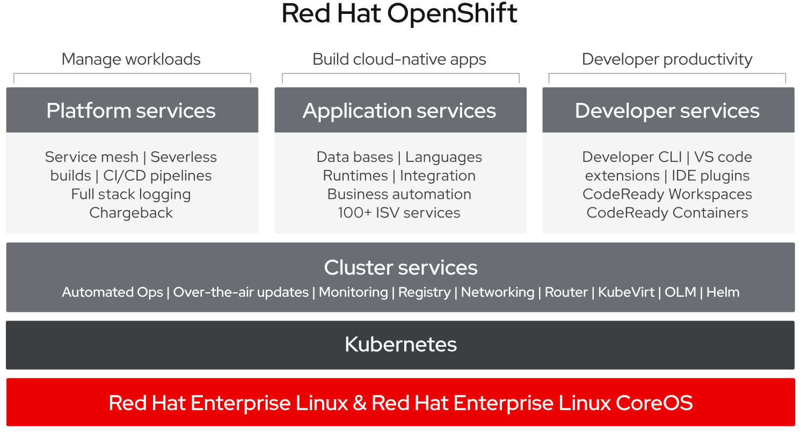
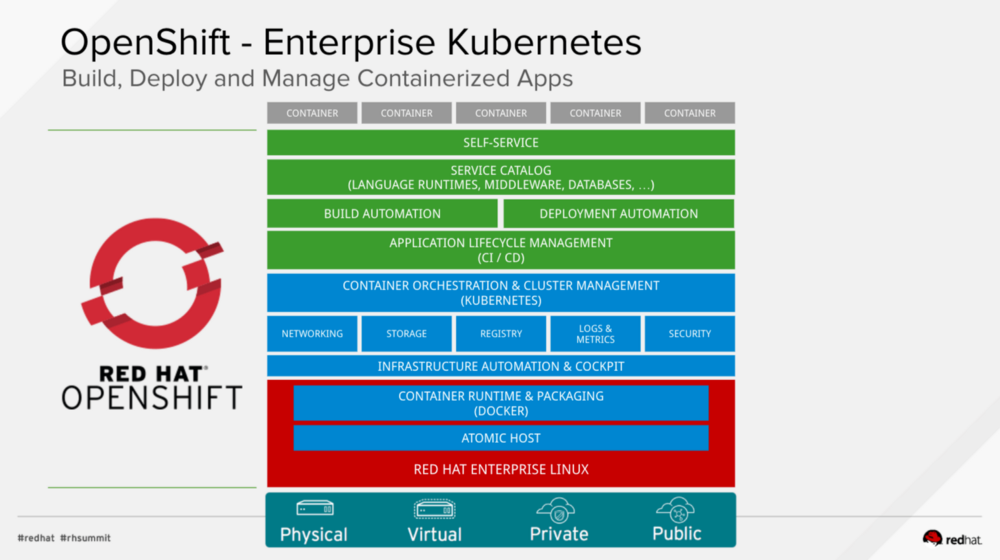
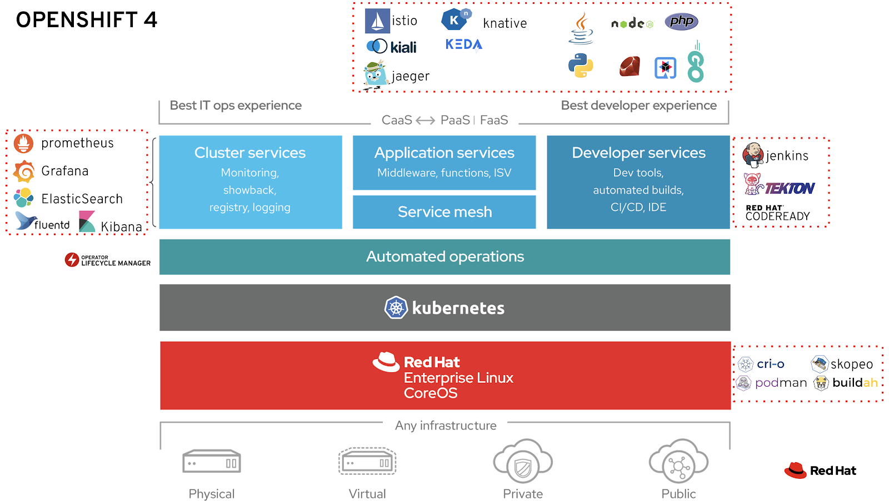

# OpenShift

OpenShift es una distribución de Kubernetes que añade funcionalidades centradas en la automatización, seguridad y *developer experience*.

Es una distribución propietaria de RedHat, muy utilizada a nivel empresarial por estas nuevas capas y por el soporte de esta compañía.

Puede ser desplegada en cualquier entorno (cloud, on-premise, local).

También puedes verla como OCP (OpenShift Container Platform)

Sitio web oficial: [https://www.openshift.com](https://www.openshift.com)

Documentación oficial con todos los ejemplos y guías: [https://docs.openshift.com/](https://docs.openshift.com/)

Las capas que componen OpenShift:

Con mayor detalle:

Todos los componentes que ofrece *out of the box*:

### Kubernetes

Kubernetes es un **orquestador de contenedores**:

- Administra el despliegue de contenedores
- Preparado para entornos de producción

Kubernetes dispone de herramientas para levantar contenedores:

- En alta disponibilidad
- De forma segura
- Aislados de otras cargas de trabajo
- Conectados entre sí
- Expuestos a Internet
- Conectados con servicios en la nube

Enlaces de introducción:

- [¿Qué es Kubernetes? Web oficial](https://kubernetes.io/es/docs/concepts/overview/what-is-kubernetes/)
- [Cómic](https://cloud.google.com/kubernetes-engine/kubernetes-comic)
- [Guía ilustrada](https://www.cncf.io/wp-content/uploads/2020/08/The-Illustrated-Childrens-Guide-to-Kubernetes.pdf)

### OKD

OKD es la distribución de Kubernetes en la que se basa OpenShift. La principal diferencia entre ambos es que OKD es la distribución de código abierto, y sobre ella RedHat añade la capa de funciones *enterprise* que forman Openshift.

La arquitectura de ambas es exactamente la misma y todas las aplicaciones son compatibles. Puedes desplegar OKD de forma gratuita en cualquier entorno compatible. Las versiones de Openshift y OKD van de la mano.s

Anteriormente era llamada OpenShift Origin, es posible que aún veáis ese término.

Sitio web oficial: [https://www.okd.io](https://www.okd.io)

Documentación y guías de instalación: [https://docs.okd.io/](https://docs.okd.io/)

Diferencas entre Kubernetes, OKD y OpenShift: [https://www.openshift.com/learn/topics/kubernetes](https://www.openshift.com/learn/topics/kubernetes)

Más diferencias entre Kubernetes y OKD/OpenShift: [https://cloudowski.com/articles/10-differences-between-openshift-and-kubernetes](https://cloudowski.com/articles/10-differences-between-openshift-and-kubernetes)

### Versiones

Actualmente hay dos versiones con soporte: v3 y v4. Las aplicaciones desplegadas en cualquiera de ellas son completamente compatibles entre sí. Las mayores diferencias son a nivel de arquitectura y despliegue, nuevas funcionalidades en todos los campos, y una experiencia de usuario reformada.

Novedades de la v4:
- [https://www.openshift.com/blog/introducing-red-hat-openshift-4](https://www.openshift.com/blog/introducing-red-hat-openshift-4)
- [https://docs.okd.io/latest/whats_new/new-features.html]()

### Distribuciones para local

Minishift: Es OKD v3 para levantar en local. Crea una máquina virtual con una distribución de OKD v3 atuomáticamente.

CodeReady Containers (CRC): Es la v4. El funcionamiento es exactamente igual (una máquina virtual en local que levanta la plataforma), pero en este caso permite levantar tanto OpenShift con todas las funciones, como OKD.

CRC OpenShift: [https://developers.redhat.com/products/codeready-containers/overview](https://developers.redhat.com/products/codeready-containers/overview)

CRC OKD: [https://www.okd.io/crc.html](https://www.okd.io/crc.html)

### oc CLI

OpenShift incluye su propio CLI aparte de `kubectl`. Los comandos de ambos son prácticamente iguales, `oc` añade algunas funcionalidades interesantes e incluye todo lo necesario para trabajar con los objetos propios de OpenShift.

Instalación de oc: [https://docs.openshift.com/container-platform/4.5/cli_reference/openshift_cli/getting-started-cli.html#installing-the-cli](https://docs.openshift.com/container-platform/4.5/cli_reference/openshift_cli/getting-started-cli.html#installing-the-cli)

### Componentes más importantes incluidos con OpenShift

(Y no en Kubernetes)

[Docker Registry privado](https://docs.openshift.com/container-platform/4.5/registry/architecture-component-imageregistry.html)

[Operators](https://docs.openshift.com/container-platform/4.5/operators/understanding/olm-what-operators-are.html) (v4)

[Service Mesh](https://docs.openshift.com/container-platform/4.5/service_mesh/v1x/servicemesh-release-notes.html)  (v4)

[Monitorización](https://docs.openshift.com/container-platform/4.5/monitoring/cluster_monitoring/about-cluster-monitoring.html)

### Instalación de OKD en máquinas virtuales

OKD es una distribución libre y por ello se puede desplegar en cualquier entorno. En concreto para desplegarlo en *bare metal*  debes tener máquinas virtuales con ciertos requisitos y con el sistema operativo Fedora.

Overview del proceso de instalación: [https://docs.okd.io/latest/architecture/architecture-installation.html#architecture-installation](https://docs.okd.io/latest/architecture/architecture-installation.html#architecture-installation)

Guía para *bare metal*: [https://docs.okd.io/latest/installing/installing_bare_metal/installing-bare-metal.html](https://docs.okd.io/latest/installing/installing_bare_metal/installing-bare-metal.html)

# Comandos básicos con oc

Conectarse a un clúster: `oc login -u <USER> -p <PASSWORD> <URL>`

Crear un proyecto: `oc new-project <PROJECT>`

Listar proyectos a los que tengo acceso: `oc projects`

Cambiar de proyecto: `oc project <PROJECT>`

Crea objetos a partir de un archivo YAML: `oc apply -f <FILE>`

Eliminar objetos a partir de un archivo YAML: `oc delete -f <FILE>`

Listar cualquier objeto: `oc get <TYPE>`

Inspeccionar un objeto en concreto: `oc get <TYPE> <NAME>` `oc get <TYPE> <NAME> -o yaml`

Ver la descripción y eventos de un objeto en concreto: `oc describe <TYPE> <NAME>`

# Objetos de Kubernetes y OpenShift (y OKD)

## Nodos

Son los servidores físicos que forman parte del clúster.

Lista todos los nodos con `oc get nodes`

## Pod

Un Pod en Kubernetes es un objeto que define una **carga de trabajo**. Es decir, un Pod es uno o varios contenedores que son ejecutados conjuntamente en Kubernetes.

Crea un pod con `oc apply -f pod-tomcat.yaml`

Lista todos los pod con `oc get pod`

Ver la descripción del pod:  `oc describe pod tomcat`

## Deployments

El objeto Deployment define una aplicación con varias réplicas. El Deployment a su vez crea y gestiona los pods que corresponden a esa definición.

Crea un deployment con `oc apply -f deployment-tomcat.yaml`

Lista todos los deployment con `oc get deploy`

### Imágenes privadas

Si quieres desplegar imágenes desde repositorios privados de Docker deberás añadir el parámetro `ImagePullSecret` en spec.template.spec. Puedes ver un ejemplo en `deployment-weblogic.yaml`

## DeploymentConfig

Similar to deployment. deploymentConfig es un objeto propio de Openshift que da todas las funcionalidades del objeto deployment y añade en el `spec` el campo `triggers`, con el que podemos hacer que el deploymentConfig actualice automáticamente sus pods cuando observa cambios en una imagen de Docker por ejemplo.

Crea un deployment con `oc apply -f deployment-config-petclinic.yaml`

Lista todos los deployment con `oc get dc`

## DaemonSet

El objeto DaemonSet despliega un pod (solo uno) en cada nodo del clúster

Crea un DaemonSet con `oc apply -f daemonset.yaml`

Lista todos los DaemonSet con `oc get ds`

## Statefulset

El objeto Statefulset define una aplicación que tiene datos persistentes en disco (por ejemplo una base de datos). Es prácticamente igual que el deployment, pero levanta los pods siempre con un nombre fijo de forma que los datos pueden persistir entre despliegues y reinicios.

Crea un statefulset con `oc apply -f statefulset.yaml`

Lista todos los statefulset con `oc get statefulset`

## Job

El objeto Job define una carga de trabajo puntual, una tarea que finalizará con éxito en algún momento.

Crea un job con `oc apply -f job.yaml`

Lista todos los job con `oc get job`

## CronJob

El objeto CronJob crea jobs de forma periódica. Por ejemplo, todas las noches, para ejecutar tareas cada cierto tiempo

Crea un job con `oc apply -f cronjob.yaml`

Lista todos los job con `oc get cronjob`

## Service

Service representa un balanceador de carga entre varios pods que comparten una misma etiqueta, normalmente entre las réplicas de un mismo deployment o statefulset

Crea un service con `oc apply -f service-tomcat.yaml`

Lista todos los service con `oc get service`

## Route

Permite configurar el router incluido con OpenShift para que dirija tráfico a tu aplicación. El router expone una IP pública, hacia la que se puede dirigir cualquier dominio. Con un Route se define qué dominio deber ser dirigido a tu servicio en concreto. También se pueden configurar distintas rutas y dividir el tráfico entre distintos servicios.

Puedes crear un Route con `oc apply -f route.yaml`

Referencia de todas las posibilidades de Route: [https://docs.openshift.com/container-platform/4.5/welcome/index.html](https://docs.openshift.com/container-platform/4.5/welcome/index.html)

## ConfigMap

Configmap contiene una o varias variables que más adelante se pueden montar en cualquier carga de trabajo.

Crea un service con `kubectl apply -f configmap.yaml`

Lista todos los service con `kubectl get configmap`

Puedes crear un configMap a partir de un archivo o carpeta con `kubectl create configmap`

En el ejemplo `deployment-petclinic.yaml` tienes un ejemplo de cómo montar un configMap como volumen y como variables de entorno.

## Secret

Similar a configmap, pero los datos se almacenan codificados en base64

Crea un service con `kubectl apply -f secret.yaml`

Lista todos los service con `kubectl get secret`

Puedes crear un secret a partir de un archivo o carpeta con `kubectl create secret generic`

También puedes crear un secret especial con las credenciales para acceder a registries privados:

`kubectl create secret docker-registry`

## PersistentVolume

Un persistentVolume representa un disco persistente de cualquier tipo que está disponible para ser utilizado en Kubernetes.

Lo habitual no es crear estos persistentVolume de forma manual sino que una storageClass los cree automáticamente cuando detecta un nuevo persistentVolumeClaim

Crea un persistentVolume con `kubectl apply -f persistentvolume.yaml`

Lista todos los persistentVolume con `kubectl get pv`

## PersistentVolumeClaim
Un persistentVolumeClaim representa una petición de disco persistente, con ciertos requisitos de tamaño y modos de acceso. Éstos son asociados con pod para habilitar persistencia de datos a sus contenedores. Kubernetes asociará un persistentVolumeClaim con un persistentVolume que cumpla sus requisitos.

Crea un persistentVolumeClaim con `kubectl apply -f persistentvolumeclaim.yaml`

Lista todos los persistentVolumeClaim con `kubectl get pvc`

## ServiceAccount

Representa un token de autenticación que puede ser montado en los pods. Este token sirve para autenticar las peticiones que realice ese pod hacia el propio cluster de OpenShift. Con Roles y RoleBindings se puede dar permisos a esta serviceAccount para que interactúa con otros recursos del clúster.

En todos los proyectos/namespaces existe una serviceAccount `default` que ser monta por defecto en todos los pods a menos que se especifique una distinta.

## BuildConfig

Define todo lo relativo a la construcción de un proyecto. En concreto tiene la información sobre el origen del código (`source`), la estrategia o método para construirlo (`strategy`) y el resultado (`output`), que en todo caso será siempre una imagen de Docker.

Puedes crear una buildConfig con `oc apply -f bc-petclinic.yaml`

Una BuildConfig puede construir:
* Dockerfiles con la estrategia `dockerStrategy`
* Contenedores a partir de imágenes preparadas para source2image con la estrategia `sourceStrategy`
* Ejecutar simplemente un contenedor personalizado con la estrategia `customStrategy`
* Jenkinsfiles, con la estrategia `jenkinsPipelineStrategy`

Referencia y ejemplo de todas las estrategias posibles: [https://docs.openshift.com/container-platform/4.5/builds/build-strategies.html](https://docs.openshift.com/container-platform/4.5/builds/build-strategies.html)

En los archivos que comienzan con `bc-.....yaml` tienes ejemplos de cada una de ellas.

La estrategia de Jenkinsfile está siendo sustituida por los pipelines. En la carpeta `tekton-pipelines` Puedes encontrar una guía rápida para éstos aquí: [https://github.com/openshift/pipelines-tutorial](https://github.com/openshift/pipelines-tutorial)

## Build 

Es simplemente una ejecución de una buildConfig

Puedes lanzar una build con `oc start-build`

## ImageStream

Representa una imagen de Docker presente en el registry interno de OpenShift. Nos permite abstraernos de la conexión con el registry.

En `bc-petclinic.yaml` creamos y utilizamos imageStream en una buildConfig

## HorizontalPodAutoscaling

Con este objeto configuramos el autoescalado de un Deployment o StatefulSet. En él se espcifican los parámetros del autoescalado como el máximo y mínimo número de réplicas y las métricas y targets que dispararan el autoescalado.

Crea un HorizontalPodAutoscaling con `kubectl apply -f hpa-petclinic.yaml`

Lista todos los HorizontalPodAutoscaling con `kubectl get hpa`

# Comandos avanzados de oc para desarrolladores

`oc rsync <ORIGEN> <POD>:<DESTINO>` Sincroniza tus archivos locales con una carpeta dentro de un pod cualquiera. Útil para copiar actualizaciones de código directamente a un pod sin necesidad de construir y redesplegar todo.

`oc rsh <POD/DEPLOYMENT/STATEFULSET>` Abre una terminal sh en cualquier pod sano de los que pertenecen al objeto

`oc port-forward <POD/DEPLOYMENT/STATEFULSET> <PUERTO LOCAL>:<PUERTO REMOTO>` Mapea un puerto local a un puerto del pod que elijas. Útil para acceder directamente a la red del pod sin necesidad de tenes acceso a su IP o a un service.

`oc proxy` Mapea un puerto local a la propia API de OpenShift. Útil para acceder a servicios sin necesidad de autenticar todas las peticiones.

`oc debug <POD>` Crea un clon del pod en cuestión, y abre un terminal en su interior. Útil para hacerlo en pod que están fallando y reiniciándose constantemente, de esta forma creas uno igual para debuggear sin que se reinicie.

# Componentes importantes de OpenShift

Aunque no los manejeis vosotros, es importante saber que existen y dónde encontrarlos

## Router

Es el único componente público del clúster, el que recibe todo el tráfico HTTP y luego lo reenvía a cada service dependiendo de los objetos Route que haya configurados. Los objetos Route tienen siempre que ser un hostname que apunte a la IP pública del router. 

Normalmente el router estará en el namespace llamado `openshift-router` o `default`

## Docker Registry

Es el *DockerHub* interno de Openshift, donde se almacenan todas las imágenes que se construyen en las build.

Normalmente el router estará en el namespace llamado `openshift-registry` o `default`. Es importante conocer su dirección interna para poder subir las imágenes. Para las build internas, también puedes utilizar ImageStreams para abstraerte del registry.

# Seguridad y restricciones de Openshift

Por defecto Openshift bloquea cargas de trabajo que no cumplen unos estándares de seguridad. Esto puede hacer que imágenes que funcionan en local o en cualquier otro sistema no lo hagan en OpenShift. O que operators, Helm charts o templates para Kubernetes fallen al iniciarse.

Esto es porque la `security context constraint` o `scc` por defecto es muy restrictiva en cuanto al UID del usuario que ejecute la imagen de Docker.

Para dar permisos a tu pod para que se ejecute con cualquier id de usuario, debes dar permisos a su serviceAccount en la scc `anyuid`:

`oc adm policy add-scc-to-user anyuid -z <SERVICE ACCOUNT> -n <PROJECT> --as system:admin`

Si el pod no utiliza una serviceAccount específica, bastará con darle permisos a la serviceAccount `default`:

`oc adm policy add-scc-to-user anyuid -z default -n <PROJECT> --as system:admin`

# Source2Img (S2I)

Source2Image o S2I es un framework para construir imágenes de Docker sin necesidad de mantener un Dockerfile con cada código. Se basan en imágenes de Docker ya preparadas para albergar tu código de forma eficiente y segura. Hay muchas ya preparadas por RedHat para todos los lenguages de programación, pero también es posible crear las tuyas propias para reutilizarlas en proyectos similares.

Puedes encontrar una guía rápida en [https://github.com/openshift/source-to-image](https://github.com/openshift/source-to-image)

# Helm

Helm es un gestor de paquetes para Kubernetes/OpenShift. Básicamente es un sistema para distribuir aplicaciones preparadas para funcionar en cualquier clúster. Para ello empaquetan todos los YAML que componen la aplicación, los templatizan para que se puedan personalizar en el despliegue, y los suben a varios repositorios.

Los paquetes de Helm se llaman Helm Charts, mientras que cada instalación en tu clúster se un Chart se llama Helm Release.

En [https://artifacthub.io/](https://artifacthub.io/) encontrarás todo el software que se distribuye a través de Helm. 

Es una forma rápida de instalar aplicaciones complejas en tu clúster, muchas veces respaldadas por el propio creador. También puedes crear tus propios chart para tus aplicaciones.

Para empezar con Helm simplemente visita [https://helm.sh/](https://helm.sh/)

# Operators

Los operators cumplen una función similar a Helm (distribución de aplicaciones para Kubernetes/Openshift) pero ofrecen alguna funcionalidad más. En concreto un operator siempre despliega uno o varios pods que serán los encargados de poner en marcha y mantener esos paquetes de software cuando los instalas. 

Cuando despliegas un operator, pongamos uno para MongoDB, lo único que se despliega de primeras es ese pod con el controlador para instalar y mantener instancias de MongoDB. Además de una definición de objetos nuevos que representarán esas instancias (por ejemplo mongodb.com/v1/MongoDB). Creando un objeto de ese tipo, el controlador levantará un clúster con las especificaciones que le hayas dado a tu objeto. También se encargará de que siempre siga así, en caso de que hubiese cualquier problema.

El repositorio de operators que puedes desplegar está en [https://operatorhub.io/](https://operatorhub.io/) y también en la misma interfaz web de OpenShift.

Muschos operators también están respaldados por RedHat o por los creadores.

# odo

odo (Openshift do) en un CLI de nueva creación para hacer más sencillo el desarrollo de aplicaciones directamente en OpenShift. Abstrae de toda la gestión de objetos como pods, services, deployments, buidls, etc, los cuales crea automáticamente de forma transparente. También contiene comandos útiles para desarrolladores como publicar una URL para la aplicación, sincronizar archivos desde tu local, acceso a puertos, etc.

Puedes comenzar a utilziar odo en: [https://github.com/openshift/odo](https://github.com/openshift/odo)